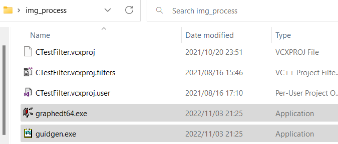
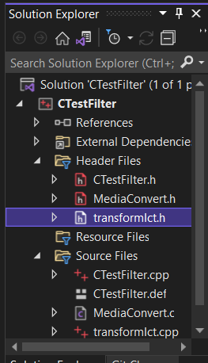

# 音视频编码与技术作业

## 软硬件信息

| Language    | Platform  | Author | EMAIL                                                        |
| ----------- | --------- | ------ | ------------------------------------------------------------ |
| Cpp(VS2022) | Windows11 | ZhaoY  | [liuzhy86@mail2.sysu.edu.cn](mailto:liuzhy86@mail2.sysu.edu.cn) |

## DirectShow初指导

* 首先将梁凡老师的百度网盘文件下载下来

  

* 打开`DirectShow`并将`CTestFilter.zip`解压到合适的地方（可以包含中文，但是不要包含特殊字符，如$'`:等）

  

  

* 将`DirectShow/sequence/BasketballPass_416x240_50_IYUV.avi`文件拷贝到`assets`文件夹下，将`DirectShow/graphedt64.exe`与`DirectShow/guidgen.exe`拷贝到项目根目录下

  

* 打开梁凡老师的CTestFilter项目(双击`CTestFilter.sln` Visual Studio将会打开这个项目)

  

* 梁凡老师的项目写于VS2014(应该是)，sdk与一些东西不匹配，会跳出下面的窗口，点`OK`自动更新即可

  

* 由于我们直接基于梁凡老师的CTestFilter项目，故DirectShow里面很多指引我们都不需要做了(如果有大佬自己写还是得看看前面一些教程；基于CTestFilter只需修改一步)，直接转进Project -> Properties上的内容修改，点击Properties

  

* 首先修改Debugging的Command(即graphedt64.exe的路径)，将梁凡老师的**D:\我的工作\DirectShow\graphstudionext-0.7.1.62.exe**

  

  改为**你的项目路径/graphedt64.exe**(如**C:/Users/zqliu/Desktop/img_process/graphedt64.exe**)，然后点击`Apply`执行修改

  

* 以第二次代码为例，创建你的处理函数/文件，如下`transformIct.h/cpp`，编写一个处理函数`transformIct`

  

* 在`CTestFilter.cpp`大概360行处插入你的处理函数(如`transformIct`)

  

* 改为64位程序

  

  

* 点击`Local Windows Debugger`或者F5运行，成功运行后会出现这样的界面

  

  但是你会发现你找不到里面有你写的处理器，原因是没有对输出文件.ax进行注册，需要使用`regsvr32.exe`对.ax进行注册

  

* 成功运行后会生成.ax文件，位置在`x64/Debug`文件夹下

  

* 以管理员模式打开powershell或者cmd

  

  输入下列指令即可完成注册

  ```
  cd 你的项目文件夹路径 # 如 C:\Users\xxx\Desktop\img_process\
  regsvr32.exe ./x64/Debug/CTestFilter.ax
  ```

  

* 重新运行一遍项目，点击左上角File -> Render Media File，将`assets`下的视频引入

  

  

* 删除中间的东西，然后在Graph -> insert filters-> DirectShow Filters -> Test Filter -> insert filter

  

  

* 连线，ctrl+S 保存这张图

  

  

* 点击运行三角形，完成输出

  

  

* 若要是播放白屏没内容，则使用 Graph -> insert filters-> DirectShow Filters -> enhance video randerer代替video renderer

  

  

* 后续就是不愉快的算法编写部分了~
